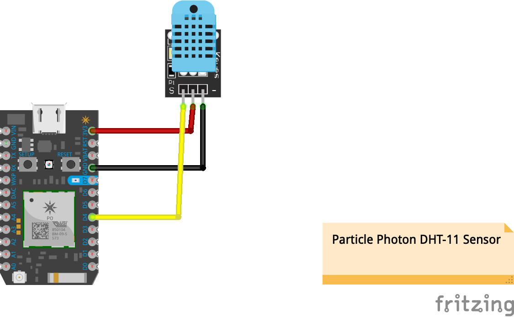

# Blynk DTH11 Sensor

>A Sensor Mote using [Particle Photon](https://docs.particle.io/photon/) that comunicates via Wifi with [Blynk App](https://blynk.io/)

## Libraries
This projects uses several libraries:
- [blynk](https://github.com/blynkkk/blynk-library) Allows comunication with [Blynk App](https://play.google.com/store/apps/details?id=cc.blynk)
- [DHT](https://github.com/adafruit/DHT-sensor-library) to read the sensor data.
- [Adafruit_Sensor](https://github.com/adafruit/Adafruit_Sensor)

## The Circuit:


You can also open the Frizting file [here](particle-dht11-sensor.fzz)


  * Particle's D4 connected to Vout digital signal pin (single-wire serial interface) of the Keystudio [Ks0034 DHT11](https://wiki.keyestudio.com/Ks0034_keyestudio_DHT11_Temperature_and_Humidity_Sensor) Temperature and Humidity Sensor
  * DTHT11 Vcc+ to the photon's 3.3V Vout.
  * DTHT11 GND to the photon's GND pin.

## Setting Up Blynk App

Download the app from your personal store favorite store [ Google Play](https://play.google.com/store/apps/details?id=cc.blynk) |
[ App Store](https://itunes.apple.com/us/app/blynk-control-arduino-raspberry/id808760481?ls=1&mt=8)

1. Setup New Project, in this step make sure you select `Particle Photon` and `Wifi`. 
2. You will recieve an email with your **auth token key**. Make sure you add it to  your `src/dth11-sensor.ino` at line 21 ```char auth[] = "<Your awesome Blynk auth token should go here>";```
3. In the toolbar, tap the + button open the **Widget Box**, 
4. Select 2 `Gauge Widgets` (one for temperature and one for humidty). Also we will use a `SuperChart` for both 
5. Configure the `Temperature Gauge` as shown in the picture below (Really important that you chose Virtual Port 1 **V1** for temperature since is defined here `#define BLYNK_TEMP_DISPLAY V1`) 
6. Do the same for the `Humidty Gauge`, make sure you select Virtual port 2 **V2** `#define BLYNK_HUMIDITY_DISPLAY V2` .
7. For the graph is pretty easy, just  define which *Datastreams* you need 

If you still have doubts regarding how to setup Blynk to use this project, follow this [guide](http://docs.blynk.cc/#getting-started-getting-started-with-the-blynk-app) or contact me trough [twitter: @alvarosaburido1](https://twitter.com/alvarosaburido1)


## Development

Every new Particle project is composed of 3 important elements that you'll see have been created in your project directory for dth11-sensor.

#### ```/src``` folder:
This is the source folder that contains the firmware files for your project. It should *not* be renamed.
Anything that is in this folder when you compile your project will be sent to our compile service and compiled into a firmware binary for the Particle device that you have targeted.

If your application contains multiple files, they should all be included in the `src` folder. If your firmware depends on Particle libraries, those dependencies are specified in the `project.properties` file referenced below.

#### ```.ino``` file:
This file is the firmware that will run as the primary application on your Particle device. It contains a `setup()` and `loop()` function, and can be written in Wiring or C/C++. For more information about using the Particle firmware API to create firmware for your Particle device, refer to the [Firmware Reference](https://docs.particle.io/reference/firmware/) section of the Particle documentation.

#### ```project.properties``` file:
This is the file that specifies the name and version number of the libraries that your project depends on. Dependencies are added automatically to your `project.properties` file when you add a library to a project using the `particle library add` command in the CLI or add a library in the Desktop IDE.

## Adding additional files to your project

#### Projects with multiple sources
If you would like add additional files to your application, they should be added to the `/src` folder. All files in the `/src` folder will be sent to the Particle Cloud to produce a compiled binary.

#### Projects with external libraries
If your project includes a library that has not been registered in the Particle libraries system, you should create a new folder named `/lib/<libraryname>/src` under `/<project dir>` and add the `.h`, `.cpp` & `library.properties` files for your library there. Read the [Firmware Libraries guide](https://docs.particle.io/guide/tools-and-features/libraries/) for more details on how to develop libraries. Note that all contents of the `/lib` folder and subfolders will also be sent to the Cloud for compilation.

## Compiling your project

When you're ready to compile your project, make sure you have the correct Particle device target selected and run `particle compile <platform>` in the CLI or click the Compile button in the Desktop IDE. The following files in your project folder will be sent to the compile service:

- Everything in the `/src` folder, including your `.ino` application file
- The `project.properties` file for your project
- Any libraries stored under `lib/<libraryname>/src`

  # Support, Questions, or Feedback
> Contact me anytime for anything about this repo or IoT in general

* [Email: Alvaro Saburido](alvaro.saburido@gmail.com)
* [Twitter: @alvarosaburido1](https://twitter.com/alvarosaburido1)

___

# License
 [MIT](/LICENSE)
